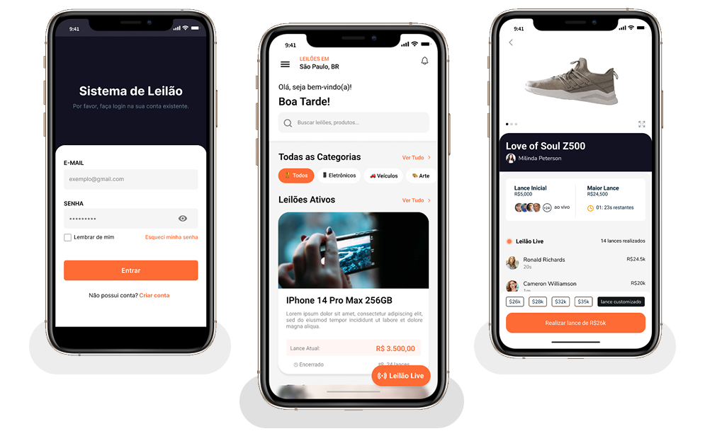

# Projeto Leilão - App Mobile

Aplicativo mobile de leilão desenvolvido com React Native e Expo, permitindo visualizar produtos, fazer buscas e filtrar por categorias.

## Tecnologias

- **React Native** - Framework para desenvolvimento mobile
- **Expo** - Plataforma para desenvolvimento React Native
- **React Navigation** - Navegação entre telas
- **Styled Components** - Estilização dos componentes
- **Axios** - Requisições HTTP
- **AsyncStorage** - Armazenamento local de dados

## Pré-requisitos

Antes de começar, certifique-se de ter instalado:

- [Node.js](https://nodejs.org/) (versão 14 ou superior)
- [npm](https://www.npmjs.com/) ou [yarn](https://yarnpkg.com/)
- [Expo Go](https://expo.dev/client) instalado no seu dispositivo móvel

## Instalação

1. Clone o repositório:

```bash
git clone https://github.com/Wigglift/Projeto-Front-End-Leilao.git
cd meu-app
```

2. Instale as dependências:

```bash
npm install
```

## Inicialização do Projeto

Para iniciar o aplicativo:

```bash
npx expo start
```

Ou use os comandos específicos da plataforma:

```bash
npm run android    # Para Android
npm run ios        # Para iOS
npm run web        # Para web
```

## Como usar

1. Após executar os comandos acima, um QR Code aparecerá no terminal
2. Abra o aplicativo **Expo Go** no seu celular
3. Escaneie o QR Code exibido
4. O aplicativo será carregado no seu dispositivo

## Estrutura do Projeto

```
meu-app/
├── src/
│   ├── components/          # Componentes reutilizáveis
│   │   └── styleds/         # Componentes estilizados
│   ├── screens/             # Telas do aplicativo
│   │   ├── Home/            # Tela principal
│   │   ├── Login/           # Tela de login
│   │   ├── Bid.jsx          # Tela de lance
│   │   └── Settings.jsx     # Tela de configurações
│   ├── services/            # Serviços e APIs
│   │   ├── api.js           # Configuração do Axios
│   │   ├── authService.js   # Serviço de autenticação
│   │   └── auctionService.js # Serviço de leilões
│   ├── styles/              # Tema e tokens de design
│   │   └── theme.js
│   └── utils/               # Utilitários
│       ├── responsive.js    # Sistema de responsividade
│       └── timeUtils.js
├── assets/                  # Imagens e recursos
├── docs/                    # Documentação técnica
│   └── responsividade.md    # Guia de responsividade
├── App.jsx                  # Componente principal
└── package.json             # Dependências do projeto
```

## Funcionalidades

- Autenticação com JWT (Bearer Token)
- Listagem de leilões por tipo
- Busca de leilões
- Filtro por categorias/tipos
- Filtros avançados (data, localidade, leiloeiro)
- Consulta de lotes de leilão
- Interface responsiva e moderna

## Documentação

Para desenvolvedores:
- [Guia de Responsividade](./docs/responsividade.md) - Sistema de estilos e responsividade
- [Integração da API](./docs/api-integration.md) - Documentação completa da integração com a API

## Scripts Disponíveis

```bash
npm start          # Inicia o Expo
npm run android    # Inicia no emulador Android
npm run ios        # Inicia no emulador iOS
npm run web        # Inicia na web
```

## API

O aplicativo se conecta à API de leilões hospedada em:
- **Base URL**: `http://ec2-3-20-227-42.us-east-2.compute.amazonaws.com:3000`

### Autenticação
- **URL**: `http://ec2-3-20-227-42.us-east-2.compute.amazonaws.com:3000/login`
- **Método**: POST
- **Credenciais**: Configuradas no authService
- **Token**: Bearer JWT (expira em 2 horas)

### Endpoints Principais
- `GET /leiloes` - Lista todos os leilões
- `GET /leiloes/tipo/:tipo` - Busca leilões por tipo
- `GET /leiloes/localidade?cidade=X&estado=Y` - Busca por localidade
- `GET /leiloes/intervalo_data/:dataInicial/:dataFinal` - Busca por intervalo de datas
- `GET /leiloes/:id/lotes` - Lista lotes de um leilão
- `GET /leiloes/tipos` - Lista todos os tipos
- `GET /leiloes/leiloeiros` - Lista todos os leiloeiros
- `GET /leiloes/cidades_estados` - Lista cidades e estados

## Protótipo da Aplicação

Este é o protótipo da nossa aplicação de leilões, desenvolvido no Figma. Será nosso guia visual para todo o processo de construção do sistema, representando a identidade visual e os principais fluxos que o usuário irá navegar dentro da aplicação.

Você pode acessar e navegar pelo design completo através do link abaixo:

🔗 [Acesse o protótipo no Figma](https://www.figma.com/design/F1pPXVJthzRKbf8bNoGMOX/Sistema-de-Leil%C3%A3o?node-id=0-1&t=vXUljPJCR0RIEPyV-1)

### Preview

[](https://www.figma.com/design/F1pPXVJthzRKbf8bNoGMOX/Sistema-de-Leil%C3%A3o?node-id=0-1&t=vXUljPJCR0RIEPyV-1)

## Notas

- O aplicativo requer conexão com a internet para acessar a API
- Token de autenticação expira após 2 horas
- Em dispositivos físicos, certifique-se de ter uma conexão estável

## Contribuindo

Contribuições são bem-vindas! Sinta-se à vontade para abrir issues e pull requests.

## Licença

Este projeto é privado e de uso educacional.
